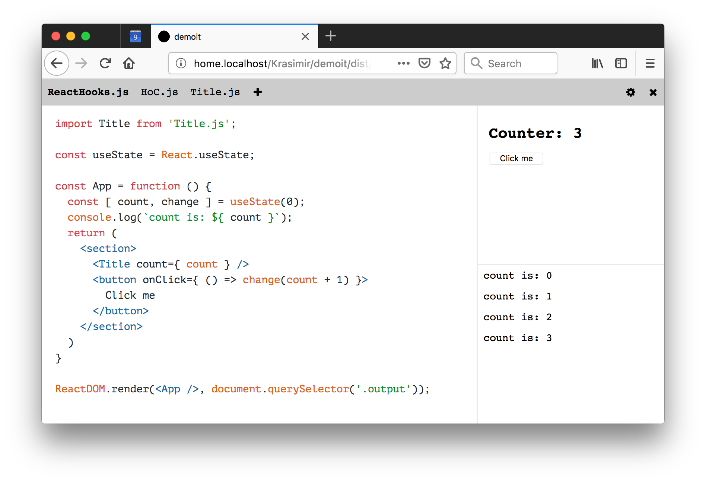
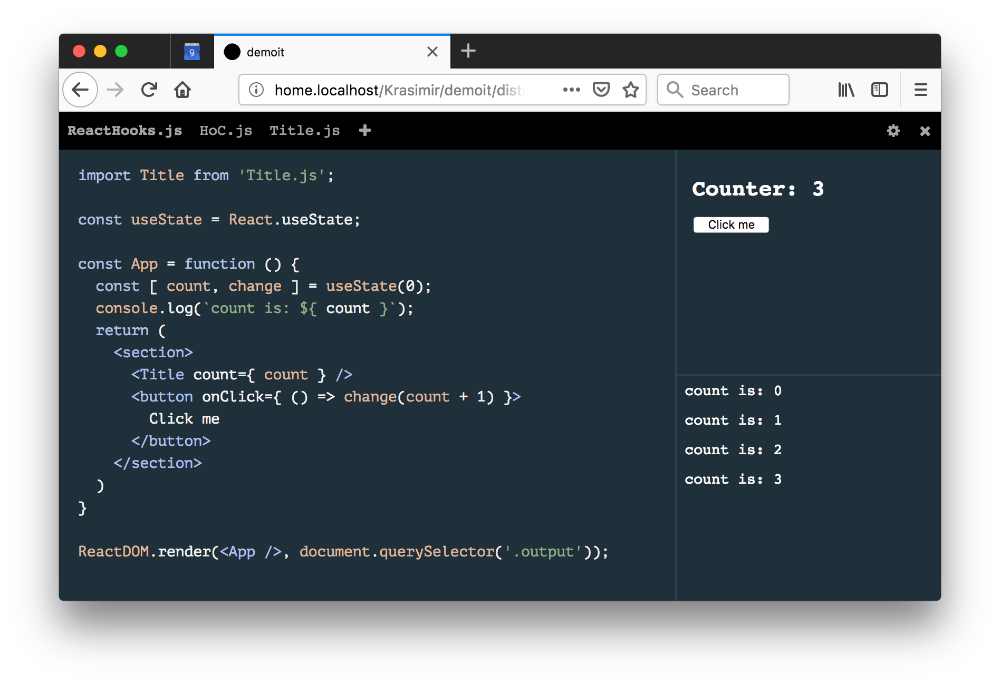

# **Demoit** is a interactive JavaScript playground

* No installation.
* No server needed. It works offline.
* No building process needed. Built-in Babel support. It translates your code at runtime.
* Supports external libraries and styles. Like React for example.
* Export your work to an external file
* Supports `import` statement (between the files of app)
* Supports `import`ing of CSS and HTML files
* Supports dependencies via HTTP (everything from [unpkg](https://unpkg.com/#/) or [cdnjs](https://cdnjs.com))

## Demo :rocket:

* React - [https://krasimir.github.io/demoit/dist](https://krasimir.github.io/demoit/dist?state=../samples/React.json)
* Vue - [https://krasimir.github.io/demoit/dist](https://krasimir.github.io/demoit/dist?state=../samples/Vue.json)
* HTML+CSS - [https://krasimir.github.io/demoit/dist](https://krasimir.github.io/demoit/dist?state=../samples/HTML+CSS.json)

---

## Usage

* Online at [krasimir.github.io/demoit/dist/](https://krasimir.github.io/demoit/dist)
* Offline by downloading [Demoit.zip](https://github.com/krasimir/demoit/raw/master/demoit.zip)

## Configuration

When you open the app and start writing code you progress gets saved to an internal state. You can grab it by opening the bar at the top and clicking on the gear icon (check the "Export" section). The JSON there contains all the configuration that Demoit needs. You can save this configuration to an external file and let Demoit knows the path to it via the `state` GET parameter (for example `http://localhost/demoit?state=./mycode.json`).

## GET Params

* `?state=<path to json file>` - relative path to a JSON file
* `?mode=preview` - it loads the editor just in a preview mode. The code is visible but not compiled and not editable. This significantly reduces the file size and it is useful for syntax highlighting.

## Continuing your work offline

* You have to download [Demoit.zip](https://github.com/krasimir/demoit/raw/master/demoit.zip)
* You need to transfer your progress to a JSON file and pass it to the app via `state` GET param
* If you use external dependencies make sure that they are also saved locally and the path to the files is properly set (check the gear icon in the status bar at the top of the app)

## Keyboard shortcuts

* `Ctrl + S` and `Cmd + S` which is basically triggering a new run of your current file.

## Editing filenames and deleting files

Right mouse click on the file's tab.

## Troubleshooting

### Error `URL scheme must be "http" or "https" for CORS request.`

It means that the browser doesn't load the files that the tool needs because the protocol is `file://`. That's a problem in Chrome at the moment. Everything works fine in Firefox. To fix the problem in Chrome you have to run it like so:

```
open /Applications/Google\ Chrome.app/ --args --disable-web-security
```
or under Windows:
```
chrome.exe --disable-web-security
```

Of course Demoit works just fine if you open `index.html` via `http` protocol but to do that you need a server.
