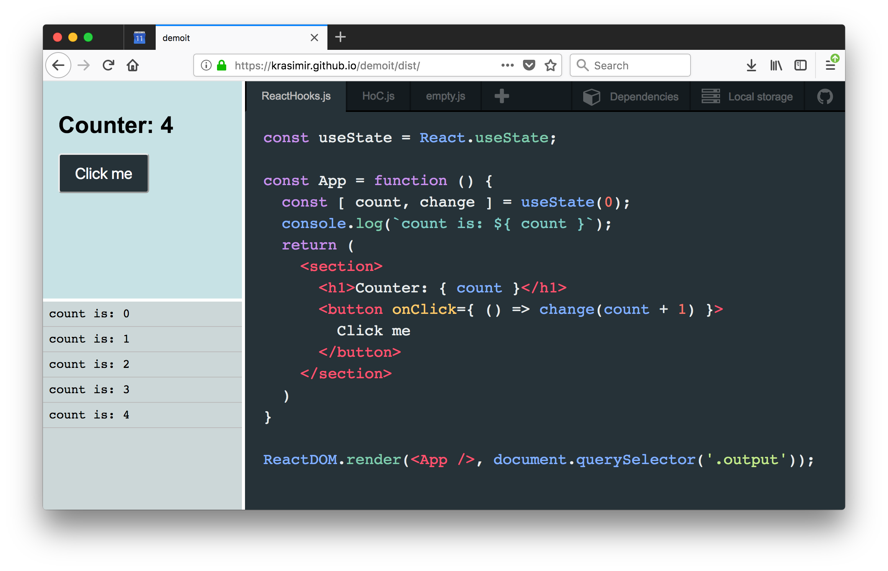

# **Demoit** is a tiny JavaScript playground

* No installation.
* No server needed. It works offline.
* No building process needed. Built-in Babel support. It translates your code at runtime.
* Supports external libraries and styles. Like React for example.
* Persistent via localStorage (for now)
* Easy export of the current code

## Demo :rocket:

[https://krasimir.github.io/demoit/dist](https://krasimir.github.io/demoit/dist?state=../samples/React.json,../samples/Vue.json,../samples/HTML+CSS.json)

---

## Usage

* Online at [krasimir.github.io/demoit/dist/](https://krasimir.github.io/demoit/dist??state=../samples/React.json,../samples/Vue.json,../samples/HTML+CSS.json)
* Offline by downloading [Demoit.zip](https://github.com/krasimir/demoit/raw/master/demoit.zip)

## Configuration

```json
{
  "editor": {
    "theme": "material"
  },
  "dependencies": [
    "./resources/react-16.7.0-alpha.0.js",
    "./resources/react-dom.16.7.0-alpha.0.js",
    "./resources/styles.css"
  ],
  "files": [
    {
      "filename": "script.js",
      "content": "const message = 'Hello world';\nconsole.log(message);"
    }
  ]
}
```

* `editor`
  * `theme` - Demoit uses CodeMirror as an editor so here you can place some of its build-in themes. Check them out [here](https://codemirror.net/demo/theme.html).
* `dependencies` - an array of files that your demo needs. This could be JavaScript or CSS files. They may be local or not. Demoit will fetch those resources before running your code files.
* `files` - It contains an array of items representing your scripts.

The configuration must be saved into a JSON file. The path of which needs to be passed to Demoit. If there is no such file (or files) the tool still works. There's just no predefined content on it.

The path to the JSON files is set via `state` GET parameter. For example: `http://localhost/demoit?state=./mycode.json`. You may pass as many JSON files as you want. Separate them with commas.

## GET Params

* `?state=` - A comma separated list of configuration JSON files
* `?autoOpenCodeSample=` - path to a configuration JSON file that will be loaded automatically. Or if the value is `LOCALSTORAGE` it will always get the config from the local storage.

## Continuing your work offline

You may need to transfer your progress on your machine. In order to do that go to the storage manager (there is a button in the top right corner of the app). Then copy the content of the text area into a JSON file on your machine. After that download [Demoit.zip](https://github.com/krasimir/demoit/raw/master/demoit.zip), unzip it and move the newly created JSON file inside the folder. The last step is to open Demoit and give the name of your JSON file. For example: `http://localhost/demoit?state=./mycode.json`

## Keyboard shortcuts

* `Ctrl + S` and `Cmd + S` which is basically triggering a new run of your current file.

## Editing filenames and deleting files

Right mouse click on the file's tab.

## Troubleshooting

### Error `URL scheme must be "http" or "https" for CORS request.`

It means that the browser doesn't load the files that the tool needs because the protocol is `file://`. That's a problem in Chrome at the moment. Everything works fine in Firefox. To fix the problem in Chrome you have to run it like so:

```
open /Applications/Google\ Chrome.app/ --args --disable-web-security
```
or under Windows:
```
chrome.exe --disable-web-security
```

Of course Demoit works just fine if you open `index.html` via `http` protocol but to do that you need a server.
